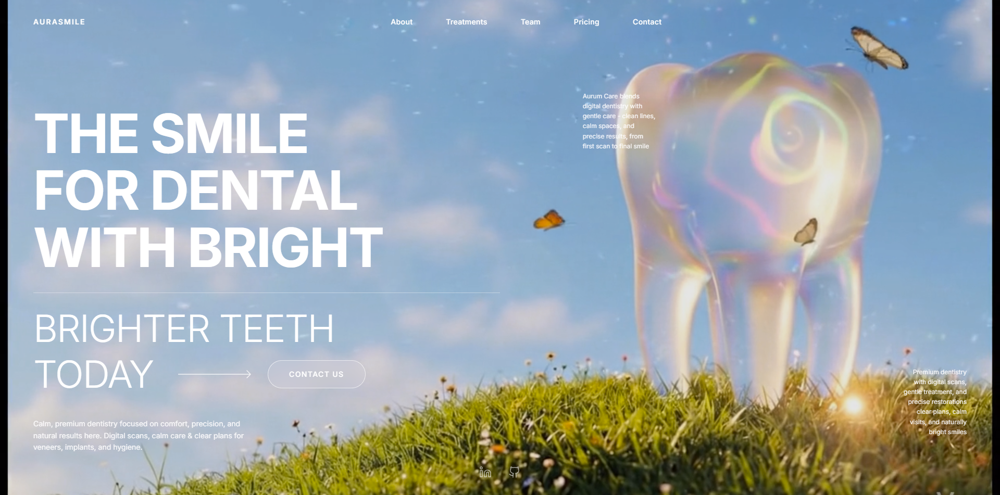

<div align="center">
   
</div>

# Aurasmile — Vibe-coded Studio UI

> A cinematic, Dribbble-inspired UI prototype built with Google Gemini / Google AI Studio. This repo contains the interactive demo and instructions to run it locally.

## Inspiration & Credits

- Design inspiration: Dribbble — https://dribbble.com/shots/27133340-Website-design-for-dental-studio
- Visual prompts and assets assisted by Google Gemini / Google AI Studio

## Key Features

- Cinematic glassmorphism, deep blurs, and layered frosted effects
- Scroll-snap driven sections with viewport-aware animations
- AI-assisted visual drafts refined into production-ready components

## Technologies

- React (v19)
- Vite
- Tailwind CSS v4
- Framer Motion / GSAP
- TypeScript

## Run Locally

**Prerequisites:** Node.js (16+ recommended)

1. Install dependencies

```bash
npm install
```

2. Start the dev server

```bash
npm run dev
```

## Screenshots

<div align="center">
   
   
</div>


